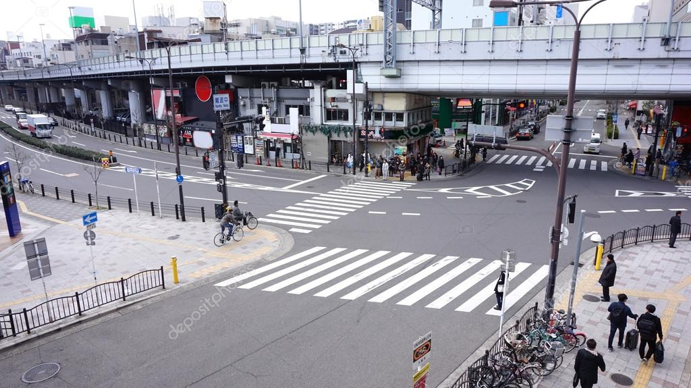

# 🚦 TrafficAI — Smart Pedestrian Traffic Signal Controller

An AI-powered traffic signal control system that uses real-time computer vision to detect pedestrians and vehicles, and dynamically adjusts traffic signals to prioritize pedestrian safety.

Built with **React**, **TypeScript**, **Vite**, and **TensorFlow.js** (COCO-SSD model).



---

## ✨ Features

- **🎥 Live Feed** — Real-time webcam-based detection of pedestrians and vehicles with bounding boxes and confidence scores
- **📤 Demo Mode** — Upload images or videos to test detection without a camera; includes a built-in sample image
- **🚦 Smart Signal Control** — Automated traffic light logic: when pedestrians outnumber vehicles (weighted), the signal turns red for vehicles so pedestrians can cross safely
- **⚙️ Configurable Settings** — Adjust priority weights, signal durations (green/yellow/red), and safety thresholds via sliders
- **🔒 Safety Features** — Minimum signal durations, maximum red time forcing green, and yellow-phase safety abort if pedestrians appear

---

## 🧠 How It Works

1. **Object Detection** — TensorFlow.js loads the COCO-SSD model in-browser to detect `person`, `car`, `bus`, `truck`, `motorcycle`, and `bicycle` objects
2. **Weighted Comparison** — Each frame, detected counts are multiplied by configurable weight multipliers: `pedestrians × pedestrianMultiplier` vs `vehicles × vehicleMultiplier`
3. **Signal State Machine** — A state machine transitions between Green → Yellow → Red based on weighted counts and configurable timing thresholds
4. **Visual Overlay** — Bounding boxes are drawn on a canvas overlay (green for pedestrians, red for vehicles) with class labels and confidence percentages

---

## 🚀 Getting Started

### Prerequisites

- **Node.js** ≥ 18
- **npm** ≥ 9 (comes with Node.js)
- A modern browser (Chrome, Edge, Firefox) with **webcam access** for Live Feed mode

### Installation

```bash
# Clone the repository
git clone https://github.com/<your-username>/TrafficAI.git
cd TrafficAI

# Install dependencies
npm install

# Start the development server
npm run dev
```

The app will be available at **http://localhost:5173**

### Build for Production

```bash
npm run build
npm run preview
```

---

## 📁 Project Structure

```
pedestrian/
├── public/
│   └── sample.png              # Sample image for Demo mode
├── src/
│   ├── components/
│   │   ├── SignalLight.tsx      # Traffic signal light component
│   │   └── SignalLight.module.css
│   ├── context/
│   │   └── TrafficContext.tsx   # Global state: counts, signal logic, thresholds
│   ├── hooks/
│   │   └── useObjectDetection.ts  # TensorFlow.js COCO-SSD model hook
│   ├── pages/
│   │   ├── LiveFeed.tsx        # Real-time webcam detection page
│   │   ├── Demo.tsx            # Image/video upload detection page
│   │   └── Settings.tsx        # Threshold & timing configuration page
│   ├── styles/
│   │   └── global.css          # Design tokens & glassmorphism styles
│   ├── App.tsx                 # Router & sidebar navigation
│   └── main.tsx                # App entry point
├── index.html
├── package.json
├── vite.config.ts
└── tsconfig.json
```

---

## 🎛️ Configuration

All settings are adjustable in real-time via the **Settings** page:

| Parameter | Default | Description |
|---|---|---|
| Pedestrian Weight | 1.0x | Multiplier for pedestrian count in priority calculation |
| Vehicle Weight | 1.0x | Multiplier for vehicle count in priority calculation |
| Min Green Time | 5.0s | Minimum time the signal stays green for vehicles |
| Yellow Duration | 3.0s | Duration of the yellow warning phase |
| Min Red Time | 5.0s | Minimum pedestrian crossing time |
| Max Red Time | 15.0s | Force green for vehicles after this duration |

---

## 🛠️ Tech Stack

| Technology | Purpose |
|---|---|
| [React 19](https://react.dev) | UI framework |
| [TypeScript](https://www.typescriptlang.org) | Type safety |
| [Vite](https://vite.dev) | Build tool & dev server |
| [TensorFlow.js](https://www.tensorflow.org/js) | In-browser ML inference |
| [COCO-SSD](https://github.com/tensorflow/tfjs-models/tree/master/coco-ssd) | Object detection model |
| [React Router](https://reactrouter.com) | Client-side routing |
| [Lucide React](https://lucide.dev) | Icon library |
| CSS Modules | Scoped component styling |

---

## 📝 Usage Guide

### Live Feed Mode
1. Grant camera access when prompted
2. Point your webcam at a street / crosswalk scene
3. The system automatically detects pedestrians (green boxes) and vehicles (red boxes)
4. The traffic signal adjusts in real-time based on detection counts

### Demo Mode
1. Click **Select File** to upload an image or video, or click **Load Sample Image**
2. Detection runs automatically on images; for videos, press play
3. View detection counts and signal response in the results panel

### Settings
- Increase **Pedestrian Weight** to make the signal favor pedestrians more aggressively
- Decrease **Min Green / Min Red Time** for faster signal transitions
- Adjust **Max Red Time** to control the maximum pedestrian crossing duration

---

## 🤝 Contributing

1. Fork the repository
2. Create a feature branch (`git checkout -b feature/amazing-feature`)
3. Commit your changes (`git commit -m 'Add amazing feature'`)
4. Push to the branch (`git push origin feature/amazing-feature`)
5. Open a Pull Request

---

## 📄 License

This project is open source and available under the [MIT License](LICENSE).

---

## 🙏 Acknowledgments

- [TensorFlow.js](https://www.tensorflow.org/js) for making ML accessible in the browser
- [COCO-SSD](https://github.com/tensorflow/tfjs-models/tree/master/coco-ssd) pre-trained model for real-time object detection
- Built with ❤️ for safer pedestrian crossings
